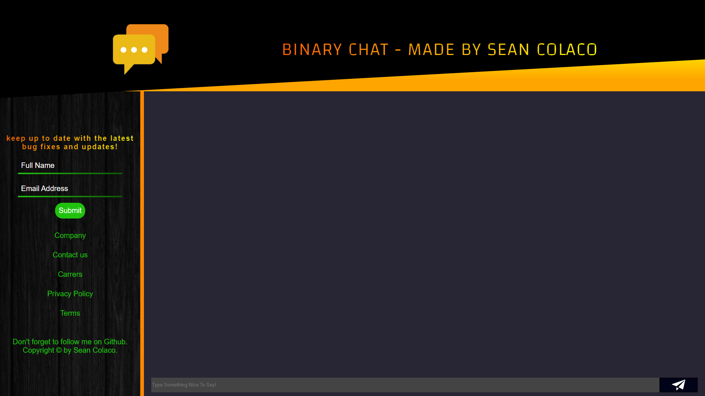
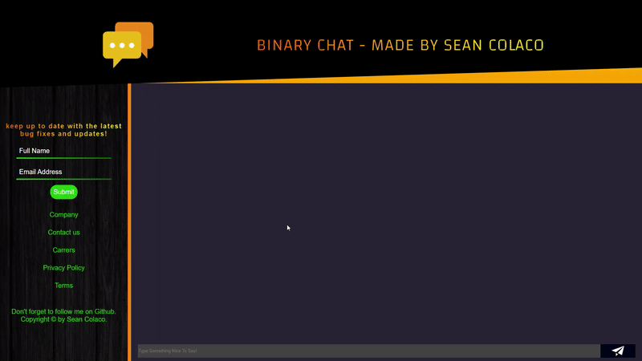
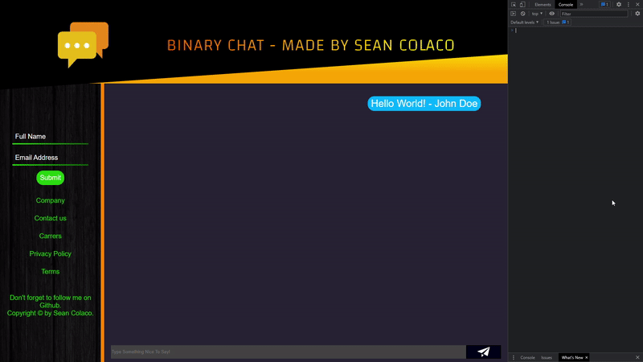
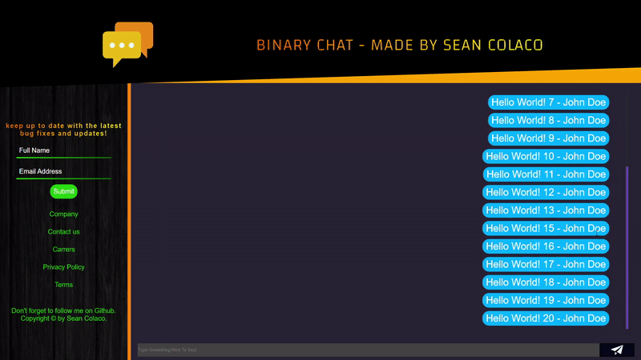
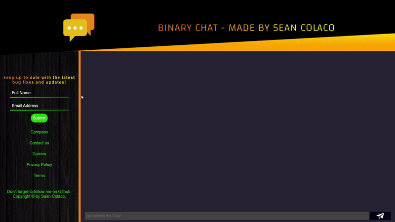

# BinaryChat
Chat Application User Interface Created with JS &amp; SASS

# How the Application Works

## Sending Messages

As soon as the user loads the application they'll be prompted to enter in their desired username (if no username is selected then "User" will be the default value).
After doing so they can then click on the input field which will activate a captivating animation which signifies they're free to type.
Once their message has been entered it'll be rendered in the chat box!

## Invalid Message

If the user hasn't input any text then the paper plane svg will flash red when hovered on and turn completely red for one second when pressed!

## Message from Other User

You can simulate what its like to receive a message from another user by opening the console and inputing "otherUser('')".
After inputing your desired message inside of the apostrophes, the message will then be rendered on the other side of the chat box.

## Excessive Messages

If an excessive amount of messages have been sent then a scroll bar will appear in order for the user to view all rendered messages.

## SideBar Animations

Don't forget to check out the smooth animations on the sidebar aswell as the sound effects when sending and receiving messages!

## Completly Responsive

### Tablet Portrait

### Phone

